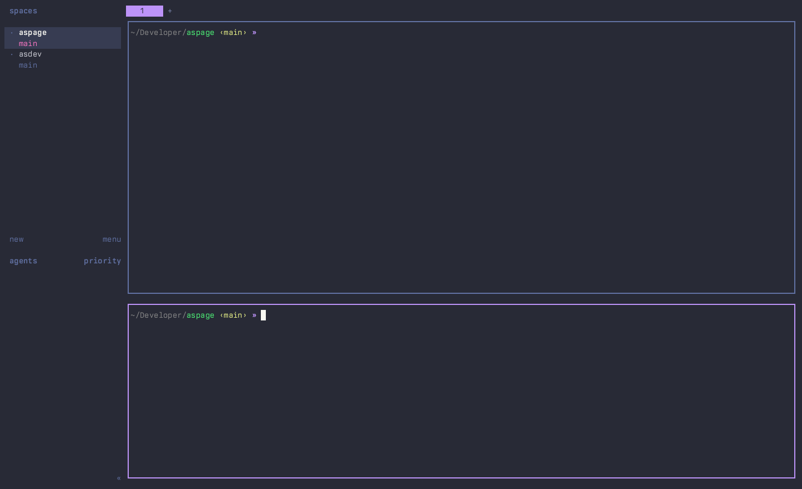

# asconfirmclose

A [herdr](https://github.com/herdrdev/herdr) plugin that replaces the
close-pane key with a smarter one: an idle shell pane closes right away, but a
pane that is running something (a coding agent, `webpack serve`, `vim`, a
long test run…) asks first.

```
  Close pane?

  Pane w48:pA is running claude
  claude --enable-auto-mode

  y close    n / esc keep
```



Herdr's built-in `ui.confirm_close` only guards workspaces and worktree
groups; `prefix+x` on a pane is immediate. This plugin fills that gap without
nagging you every time you close an empty shell.

## Requirements

- herdr 0.7.5 or newer (`herdr pane process-info` and popup plugin panes).
- macOS or Linux. Prebuilt binaries are attached to each release for
  `darwin-arm64`, `darwin-amd64`, `linux-amd64` and `linux-arm64`; on other
  platforms the install falls back to `go build` (needs a Go toolchain).

## Install

```sh
herdr plugin install asumaran/asconfirmclose
```

Then hand the close-pane key to the plugin in your herdr config
(`~/.config/herdr/config.toml`, or
`~/Library/Application Support/herdr/config.toml` on macOS if you use that
location). Clear the native binding first so the two do not fight over the key:

```toml
[keys]
close_pane = []

[[keys.command]]
key = "prefix+x"                    # or ["prefix+x", "ctrl+alt+x"], etc.
type = "plugin_action"
command = "asumaran.asconfirmclose.close"
description = "close pane (confirm if busy)"
```

Reload with `prefix+shift+r` (or `herdr server reload-config`). Check the
action is registered with `herdr plugin action list --plugin asumaran.asconfirmclose`.

To keep the native close on `prefix+x` and put the confirming one on another
key, skip the `close_pane = []` line and pick a free key.

Set `ASCONFIRMCLOSE_BUILD_FROM_SOURCE=1` before `herdr plugin install`
if you would rather compile the binary locally than download the release
asset.

## How it decides

When you press the key, the action asks herdr for the focused pane's
foreground job (`herdr pane process-info`) and looks at the processes in it:

- Only shells (`zsh`, `bash`, `fish`, `sh`, `nu`, `pwsh`, …) → the pane is
  idle and closes immediately, exactly like the native key. Nested shells
  count as idle too.
- Anything else → the pane is busy. A small popup names the process (the
  foreground group leader when it is not a shell, otherwise the first
  non-shell process, so `bash -c "webpack serve"` shows `webpack`) and its
  command line. `y` closes the pane; `n`, `Esc`, `Enter`, `q` or any other key
  keeps it.
- herdr could not describe the job (unsupported platform, transient error) →
  treated as busy with an "unknown process" notice, so an accidental keypress
  never destroys work silently.

The popup is a herdr `popup` pane: it never changes your layout, and closing
it without confirming leaves everything untouched.

## Configuration

Optional. Create `config.json` in the plugin's config directory:

```sh
herdr plugin config-dir asumaran.asconfirmclose
```

```json
{
  "ignore": ["less", "man", "htop"],
  "popup": { "width": "64", "height": "9" }
}
```

- `ignore`: process names (matched case-insensitively against the executable
  basename) that should close without asking, on top of the built-in shells.
  Handy for pagers and monitors you never mind losing.
- `popup.width` / `popup.height`: herdr popup sizes, either terminal cells or
  percentages such as `"50%"`. Defaults are 64×9.

Unknown keys or malformed JSON are reported in the plugin log and the plugin
keeps working with defaults.

## Limitations

- Only the key you bind goes through the plugin. Closing from the pane's
  right-click menu, `close_tab`, or `herdr pane close` on the CLI still closes
  immediately; herdr's plugin API cannot intercept those.
- The decision looks at the foreground job. A background job (`cmd &`) or a
  detached process does not count as busy.
- Not supported on Windows (herdr's Windows plugin runtime does not run these
  entrypoints yet).

## Development

```sh
go build -o asconfirmclose .        # the manifest runs ./asconfirmclose
go vet ./... && go test ./...
scripts/pty-check.py ./asconfirmclose   # end-to-end TUI check on a pty (python3 + pyte)
herdr plugin link "$PWD"                 # link does NOT run [[build]]; build yourself
```

- `asconfirmclose close` is the keybound action. It reads
  `HERDR_PANE_ID` (falls back to `herdr pane current`) and either closes the
  pane or opens the popup with `ASCONFIRMCLOSE_PANE_ID`, `ASCONFIRMCLOSE_PROCESS` and `ASCONFIRMCLOSE_CMDLINE`
  in its environment.
- `asconfirmclose prompt` is the popup UI (Bubble Tea v2).
- Tests cover the classification rules, the config file, the CLI contract
  against a fake `herdr`, the popup model, and an end-to-end run of the built
  binary. `go test ./...` needs no running herdr.

## Demo recording

`docs/demo.gif` is recorded with
[asdemokit](https://github.com/asumaran/asdemokit): `asdemo
record` from the repo root replays `scripts/demo/keys.json` against an
isolated herdr session described by `scripts/demo/scenario.sh`.

## Releasing

`scripts/release.sh <X.Y.Z>` gates on a clean tree plus vet/build/test,
generates the CHANGELOG entry from commit subjects, syncs the manifest
version, commits, tags and publishes the GitHub release; the release workflow
attaches the platform binaries that `scripts/fetch-binary.sh` downloads on
install.

## License

MIT
